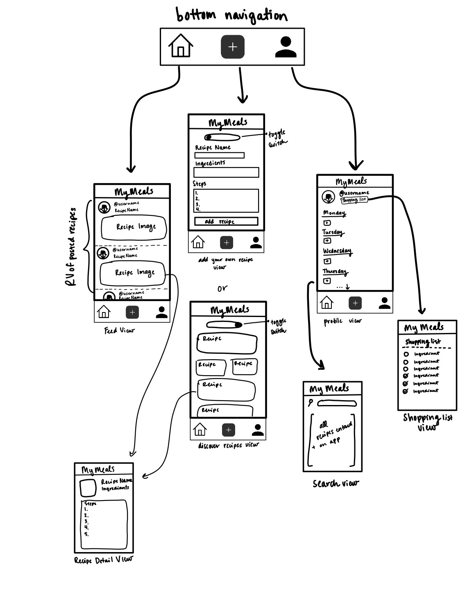

# README
**MyMeals:** App that allows users to enter their own recipes or use app suggestions and generates a meal plan and grocery list for the week.

## 1. User Stories

**Required Must-have Stories**

 - [X] User can create an account
 - [X] User can log in
 - [X] User can enter own recipes
 - [X] User can pick recipes from the app using recipe API
 - [X] User is able to generate a weekly menu
 - [X] User is able to generate a weekly shopping list
 - [X] Have a main feed where people's recipes are shared in chronological order
     - [ ] filter based on ingredients
 - [ ] People can follow others (auto approve)
 - [ ] Double tap to like

**Optional Nice-to-have Stories**

 - [ ] App tracks price of ingredients and user is able to designate a max budget
 - [ ] User can scan a preexisting recipe and have the app auto fill into a recipe card
 - [ ] Approve follow requests 
 - [ ] Recipes are shareable over messenging
 - [ ] Track items in a user's pantry
     - [ ] User can add/delete items from pantry
     - [ ] Remind users when expiration date is approaching
     - [ ] Be able to suggest a recipe based off of what a user has in their pantry already
 - [ ] User can scan barcodes of items to upload to pantry

## 2. Working Schedule
### Week 1:
 - [X] User can create an account
 - [X] User can log in
 - [X] User is able to generate a weekly menu
 - [X] User is able to generate a weekly shopping list
 - [X] Have a main feed where people's recipes are shared in chronological order

### Week 2:
 - [X] User can pick recipes from the app using recipe API
   - [X] Connect to recipe API
   - [X] Add search for recipe
   - [ ] Add recipe to WeeklyMenu
 - [ ] People can follow others (auto approve)

## 3. Screen Archetypes

 * Login Screen
   * User can login
 * Registration Screen
     * User can create a new account
 * Feed
     * User can view a feed of photos of what people are currently eating
     * User can double tap a photo to like
     * User can post a new photo to their feed
     * User can search for other users
     * User can follow/unfollow another user
 * Weekly Meal Plan
     * User can enter own recipes or pick from app
     * User is able to generate a weekly menu
     * User is able to generate a weekly shopping list
     * App tracks calories of recipes and user is able to designate a meal plan budget for the week
     * App tracks price of ingredients and user is able to designate a meal plan budget for the week
     * User can scan a preexisting recipe and have the app auto fill into a recipe card
 * Pantry
     * Track items in a user's pantry
         * User can add/delete items from pantry
         * Remind users when expiration date is approaching
         * Be able to suggest a recipe based off of what a user has in their pantry already
         * User can scan barcodes of items to upload to pantry
 * Messaging
     * User can send and receive recipe cards to individuals and groups

## 4. Navigation

**Tab Navigation** (Tab to Screen)

 * Home Feed
     * Search feed for ingredients
     * Post a Photo
 * Add new recipe
 * Weekly menu

**Flow Navigation** (Screen to Screen)

 * Login Screen
   * Home
 * Registration Screen
   * Home
 * Stream Screen
     * Search User
     * Post a photo
 * Weekly Menu
     * Add new plan
 * Pantry
     * Add new item
     * Suggest a recipe based on current items
 * Feed
     * View recipes posted recently
     * View recipe details

## 5. Schema
### Models

Post
| Propery        | Type           | Description  |
| ------------- |-------------| -----|
| objectID      | String | unique id for the user post |
| author      | Pointer to user |  Recipe author |
| image | File |   Image that author posts |
|recipeName | String | Recipe name by author |
|steps | Object (ArrayList<String>) | Recipe steps by author |
|ingredients | Object (ArrayList<String>) | Recipe ingredients by author |

 potential features: prepare time, cook time, rating, like count, commentsArray

 ### Networking
List of network requests by screen
 * Home Feed Screen
   * (Read/GET) Query all posts where user is author
   * (Create/POST) Create a new like on a post
   * (Delete) Delete existing like
   * (Create/POST) Create a new comment on a post
   * (Delete) Delete existing comment
 * Create Post Screen
   * (Create/POST) Create a new post object
   * (Read/GET) Query recipes from API host
 * Profile Screen
   * (Read/GET) Query logged in user object
   * (Update/PUT) Update user profile image
   * (Read/GET) Query all recipes from database

## 6. Wireframes
 
